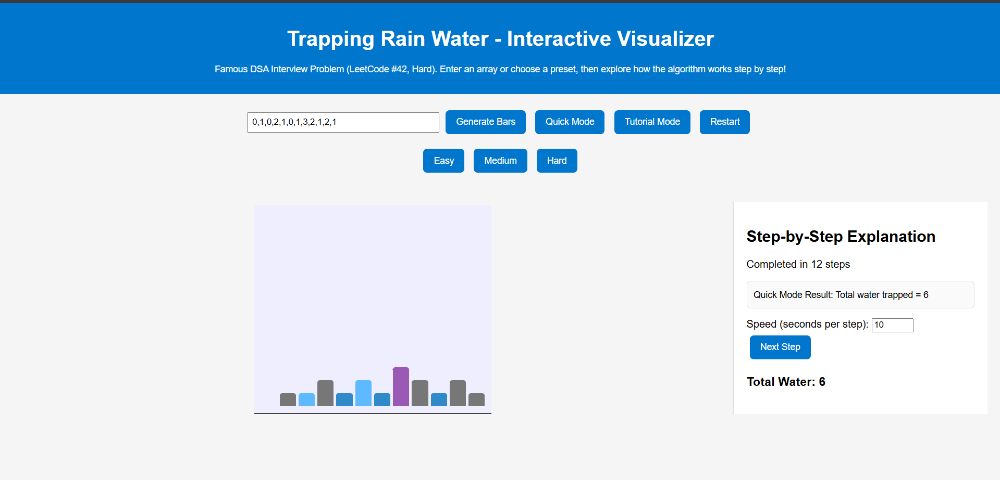

# Day 3 – Interactive Trapping Rain Water Visualizer  
Part of my **100 Days of Code Challenge**  

This project visualizes the **famous DSA interview problem**:  
**Trapping Rain Water (LeetCode #42, Hard)** – but with a **fully interactive, educational twist**.

---

## 🚀 Features
- **Quick Mode** – Instantly calculates trapped water with a visual summary.  
- **Tutorial Mode** – Step-by-step animation with:  
  - Live **water-filling visualization**  
  - **Two-pointer algorithm highlights** (`left` and `right`)  
  - **Side panel explanations** with running totals and step counters  
  - **Auto-play (default 10s per step)** and **manual "Next Step"** options.  
- **Responsive Design** – Works on desktop and mobile.  
- **User Input Support** – Enter any array or choose preset test cases (Easy, Medium, Hard).  
- **Restart Button** – Replay with the same array without refreshing.

---

---

## 📸 Preview  
  
*(Screenshot of the visualizer in action)*

---

## 🛠️ Tech Stack
- **HTML5, CSS3, JavaScript (Vanilla)** – no external frameworks.  
- **Two-pointer algorithm** for O(n) complexity and real-time visualization.

---

## 🧠 Problem Statement  
**"Given `n` non-negative integers representing an elevation map where the width of each bar is 1, compute how much water it can trap after raining."**  

Example:

Input:  height = \[0,1,0,2,1,0,1,3,2,1,2,1]
Output: 6

`
*(A classic DSA question often asked at FAANG interviews.)*

---

## 📂 How to Run Locally
1. Clone this repository: git clone https://github.com/Adityapratap-Singh/100_Days_of_Code.git

2. Navigate to Day 3 folder:
cd 100_Days_of_Code/day3
   
3. Open `index.html` in your browser.

---

## 📅 About This Challenge

I’m doing **100 Days of Code** to sharpen my **DSA + Web Development** skills.
Each day, I build a **new project** – from beginner-friendly to advanced.

Follow my journey here: [LinkedIn](https://www.linkedin.com/in/adityapratap-singh-447159215)

---